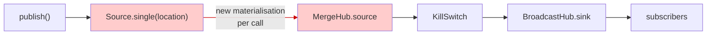
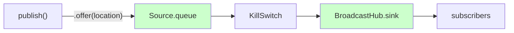
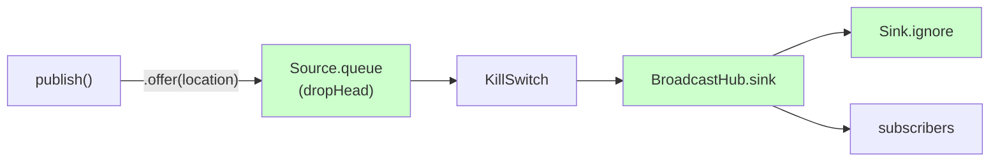

Skatemap Live is a real-time location tracking application for skating events that I've been building as a side project. Skaters broadcast GPS coordinates from their phones; the server receives these updates and pushes them to spectators watching over WebSockets. The backend is built in Scala with **Pekko Streams** handling the message routing — receiving location updates via HTTP, storing them, and broadcasting to connected viewers, a pipeline that needs to stay responsive under sustained load.

During load testing (10 simulated skaters sending updates every 3 seconds) the server was leaking memory at 17.7 MB per minute, calculated from the resident set size (RSS) slope over the 31-minute test run. The growth was linear with no sign of stabilisation. At Railway's 1 GB container limit, that meant the application would be killed in roughly 45 minutes.

I implemented a fix and validated it locally using heap dump snapshots. The heap dumps were clean, object counts stable, memory appeared to have been released during idle. After deploying to Railway, the metrics showed memory was still growing.

The snapshot profiling I had used to validate the fix had given me false confidence.

## The Symptom: 17.7 MB/min Linear Growth

In the original Railway test run, memory rose from ~250 MB to ~800 MB over 31 minutes. The growth was a straight line with no sign of the sawtooth pattern you'd expect from normal GC recovery. Something was being retained, so I investigated using heap dumps.

## Finding the Leak: Eclipse MAT Heap Dump Analysis

Heap dump analysis with **Eclipse Memory Analyzer** (MAT) revealed the culprit immediately. The leak suspects report showed 5,873 instances of `MergeHub$anon$2$anon$3` objects retaining 11.3 MB after a 30-minute test. These were Pekko Streams internal objects — materialised stream graphs that should have been cleaned up. The 11.3 MB retained size reflected heap objects visible to MAT, whereas the much larger RSS growth included JVM metadata, thread stacks, and off-heap memory beyond what a single heap snapshot reports.

The number roughly matched the expected publish call count: 10 skaters × (30 min × 60 sec / 3 sec interval) = 6,000 calls. The ~2% difference likely reflected the test duration being slightly under 30 minutes or some early objects being garbage collected.

Each event hub uses a `MergeHub` to merge location updates from multiple sources into a single broadcast stream. The publish method connected to that hub by calling `Source.single(location).runWith(hubData.sink)`. This materialises an entirely new stream graph for every single location update, creating internal objects including the `MergeHub$anon$2$anon$3` instances MAT had flagged. After the stream completed, those materialised publishers remained referenced inside the hub.

```scala
// Before: Creates new materialised stream every call
def publish(eventId: String, location: Location): Unit = {
  val hubData = getOrCreateHub(eventId)
  Source.single(location).runWith(hubData.sink)  // ← 6,000 streams in 30 minutes
}
```

Each call materialised a complete stream graph—actors, buffers, internal state—just to publish a single location update. The `MergeHub` accumulated these materialised streams; they were not reclaimed during sustained publishing.



*Stream topology before the fix. Each publish call creates a new `Source.single` materialisation into the `MergeHub`. Over a 30-minute test, this produced 6,000 materialised stream graphs that were not reclaimed during sustained publishing.*

The fix was to use `SourceQueue` (created via `Source.queue`) instead of repeatedly materialising new streams. One queue per event, reused for all publish calls.

```scala
// After: Single queue per event, reused for all publish calls
def publish(eventId: String, location: Location): Future[Unit] = {
  val hubData = getOrCreateHub(eventId)
  hubData.queue.offer(location).map {
    case QueueOfferResult.Enqueued    => ()
    case QueueOfferResult.Dropped     => logger.warn(s"Location dropped for event $eventId due to queue overflow")
    case QueueOfferResult.QueueClosed => logger.error(s"Queue closed for event $eventId")
    case QueueOfferResult.Failure(e)  => logger.error(s"Queue offer failed for event $eventId", e)
  }
}
```



*Stream topology after `SourceQueue` refactor. A single queue per event replaces 6,000 per-publish materialisations. Publish calls offer to the existing queue instead of creating new streams. With no subscribers and the default overflow strategy, the queue fills and rejects offers with `QueueOfferResult.Dropped` on every call.*

Local profiling indicated the fix addressed the per-publish materialisations. However, after deploying to Railway, metrics still showed growth: memory rose from 319 MB to 408 MB over the 39-minute run, averaging 2.1 MB/min. MAT's leak suspects showed no application objects after the `SourceQueue` refactor. The residual growth appeared to be JVM-level memory rather than application object retention.


*Memory usage on Railway after `SourceQueue` refactor. 10 skaters, 3-second intervals, 39-minute test run. The initial climb reflects JVM warmup and hub materialisation as load begins. Growth during sustained load averaged ~0.6 MB/min. The 2.1 MB/min average across the full run includes the warmup spike.*

## Pekko Streams BroadcastHub Overflow Behaviour

After the `SourceQueue` refactor, application logs showed constant queue overflow warnings when running load tests without WebSocket subscribers:

```
Location dropped for event e46d6bc9 due to queue overflow  // ← repeated on every publish call
```

The warning came from the queue's default overflow strategy. When the 128-message buffer filled and no subscribers were draining the `BroadcastHub`, the queue rejected new messages. Publishers had to handle `QueueOfferResult.Dropped` on every call, adding overhead from repeated offer failures.

The hypothesis: when no subscribers were connected, the hub's backpressure and the queue's overflow handling interacted in a way that drove memory growth during sustained publishing.

## The Attempted Fix: OverflowStrategy.dropHead

For a real-time location tracking system, the latest location is always more valuable than stale data. `OverflowStrategy.dropHead` aligned with that: drop the oldest buffered message when the queue is full, eliminating publisher/subscriber coupling so publishers could operate independently of whether anyone was listening. Removing the overflow warnings felt like removing noise, not removing a safety mechanism.

The change added `dropHead`. Since it avoids backpressure by dropping the oldest element, explicit failure handling for overflow was no longer required:

```scala
// After: dropHead allows publishers to succeed without subscribers
val ((queue, killSwitch), source) = Source
  .queue[Location](config.bufferSize, OverflowStrategy.dropHead)  // ← Drops oldest when full
  .viaMat(KillSwitches.single)(Keep.both)
  .toMat(BroadcastHub.sink[Location](bufferSize = config.bufferSize))(Keep.both)
  .run()

def publish(eventId: String, location: Location): Future[Unit] = {
  val hubData = getOrCreateHub(eventId)
  hubData.queue.offer(location).map(_ => ())  // ← No failure handling needed
}
```

I tested locally with an extended load run: 45 minutes (up from the 10-minute baseline), 10 skaters, 3-second intervals, no subscribers. Once the test completed, I took a heap dump, waited 20 minutes idle, then took another. I compared results against the baseline from the same local environment:

| Configuration | Heap After Load | Heap After Idle | Growth Rate |
|--|--|--|--|
| Local without `dropHead` | 172 MB (10 min) | 172 MB (unchanged) | 11.7 MB/min |
| Local with `dropHead` | **128 MB (45 min)** | **126 MB (decreased)** | **2.8 MB/min** |

*Note: The growth rate metric (MB/min) normalises for the difference in test duration.*

Memory was released during idle, dropping from 128 MB to 126 MB, and object counts fell from 1,295,793 to 1,278,952. MAT leak suspects showed only JVM infrastructure, no application code. Growth rate fell 76% with no overflow warnings during the entire 45-minute test.

I deployed to Railway, confident the leak was resolved.

## Local Success, Railway Failure

Local snapshots suggested a growth rate of 2.8 MB/min. On Railway, the `SourceQueue` refactor had brought the growth rate down to 2.1 MB/min. After adding `dropHead`, it jumped to 15.0 MB/min.

Here's what Railway showed across the three configurations, all under the same load parameters (10 skaters, 3-second intervals, no subscribers):

| Configuration | Growth Rate |
|--|--|
| Original leak | 17.7 MB/min |
| After `SourceQueue` refactor | 2.1 MB/min |
| **After `dropHead` strategy** | **15.0 MB/min** |

The `dropHead` change reversed most of the `SourceQueue` improvement. The first leak stemmed from per-publish materialisation; the regression, from bypassing backpressure in an otherwise correct topology.

Compare that with what local profiling showed:

| Configuration | Growth Rate | Change |
|--|--|--|
| Local without `dropHead` | 11.7 MB/min | — |
| **Local with `dropHead`** | **2.8 MB/min** | **-76%** |

On Railway, memory grew from 300 MB to 750 MB over 30 minutes. The local environment leaked memory at 11.7 MB/min before the fix while Railway leaked at 17.7 MB/min. The environments weren't comparable. Railway ran in a constrained 1 GB container with different heap limits and GC behaviour than the local development environment. Local validation alone couldn't give confidence in the fix.

The local profiling results weren't wrong about what they measured.

They just didn't measure enough.

## Why Snapshots Missed the Regression

Local profiling relied on heap dump snapshots taken after load and after idle. The snapshots showed 128 MB dropping to 126 MB after idle, which appeared to confirm memory was being released. This captured memory state at specific points that may not have reflected peak usage during load.

Railway's continuous memory graph showed what snapshots missed. It revealed 300 MB to 750 MB of linear growth at 15.0 MB/min after deploying the `dropHead` change. Buffers were refilling faster than they could be drained, with no release during load.

The fact that memory dropped from 128 MB to 126 MB during idle didn't prove the absence of leaks during load. Memory could have accumulated during load and been partially garbage-collected during idle, but Railway showed no such release: memory climbed continuously.

MAT's leak suspects report found nothing because this wasn't a traditional leak where objects are never garbage-collected. Stream graph internal buffers were eventually reclaimed, but the accumulation rate exceeded what the garbage collector could recover. Railway's continuous monitoring caught what snapshots could not.

### The Backpressure Conflict

The `dropHead` strategy conflicted with `BroadcastHub`'s design. When no subscribers are present, [`BroadcastHub` applies backpressure upstream](https://pekko.apache.org/docs/pekko/current/stream/stream-dynamic.html) to pause message flow and prevent unbounded buffering.

`OverflowStrategy.dropHead` works against this. By dropping the oldest element when the buffer is full, it allows offers to complete instead of failing. The queue no longer surfaced backpressure to the publisher via failed offers, so publishing continued at the offered rate even with no downstream demand. Messages accumulated in hub and stream internal buffers with no consumer to drain them.

The `dropHead` fix eliminated the overflow warnings while removing the defence that was limiting accumulation. It was a reasonable choice … but with an unexpected consequence.

## The Fix: Sink.ignore

The [documented Pekko pattern](https://pekko.apache.org/docs/pekko/current/stream/stream-dynamic.html) for `BroadcastHub` with intermittent subscribers is to attach `Sink.ignore` to continuously drain the hub. I had overlooked this pattern during the first refactor.

```scala
val ((queue, killSwitch), source) = Source
  .queue[Location](config.bufferSize, OverflowStrategy.dropHead)
  .viaMat(KillSwitches.single)(Keep.both)
  .toMat(BroadcastHub.sink[Location](bufferSize = config.bufferSize))(Keep.both)
  .run()

source.runWith(Sink.ignore)  // ← Continuously drain hub when no real subscribers
```

When no subscribers are connected, `Sink.ignore` drains messages to prevent accumulation. When subscribers arrive, `BroadcastHub` broadcasts to both `Sink.ignore` and the consumers. The `dropHead` strategy remains useful for handling traffic spikes.



*Final stream topology. `Sink.ignore` continuously drains the hub when no subscribers are connected, preventing buffer accumulation. When subscribers arrive, `BroadcastHub` broadcasts to both `Sink.ignore` and the consumers. `dropHead` handles traffic spikes by dropping the oldest buffered message rather than rejecting the offer.*

After deploying the fix to Railway, the 25-minute run showed residual growth of ~0.4 MB/min, a 98% reduction from the original 17.7 MB/min. Memory levelled off once the test ended, with no continuous accumulation.

## Closing the Gap Between Local and Railway

Local profiling has its place: waiting for a Railway deployment to validate every change is slow.

But local profiling has to match how the deployment environment measures. A heap dump taken at a discrete moment captures memory state at one point in time. A leak where buffers refill faster than they drain will look clean in snapshots but linear in a continuous graph. Snapshots show you what the garbage collector cleaned up. Continuous monitoring shows you what's accumulating.

Profiling and observability tooling is easy to deprioritise. The application comes first, the infrastructure later. But if continuous monitoring had been part of the local profiling setup from the start, the `dropHead` regression would have been caught before it reached Railway.

MAT identified the `MergeHub` leak immediately, but it answers one question: *what* is leaking. It does not answer *whether* memory is growing over time. **Java Flight Recorder** (JFR) closes that gap. JFR captures heap usage at each garbage collection throughout a test with minimal overhead. The recording data produces a heap-over-time graph, with linear regression to calculate growth rate. This gives local profiling the same continuous view that Railway's metrics provide.

A heap dump shows you what the garbage collector cleaned up. Continuous monitoring shows you what it couldn't keep up with.

The tools you use to validate a fix matter as much as the fix itself.

## What's Still There

The `Sink.ignore` fix resolved the leak. But something remained: the JVM acquired memory during load and retained it after load ended. Heap dumps were clean, with zero application object retention, yet process-level memory stayed elevated. That investigation, involving Native Memory Tracking and JIT code cache behaviour, is another story.